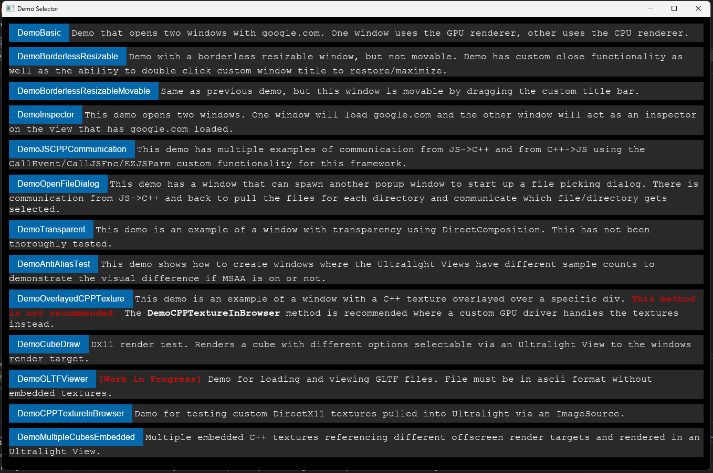
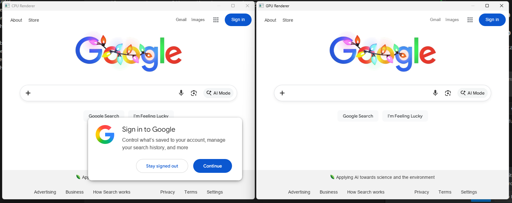
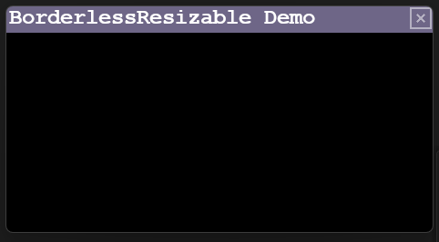
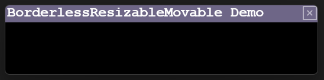

# Examples Documentation

## Demos
There are many different demos in this project. To access a demo in the application, simply click the button with the name of the Demo.

## #1 -> DemoBasic
This demo opens two windows that load google.com One window is using the GPU renderer implementation and the other uses CPU rendering.

## #2 -> DemoBorderlessResizable
This demo creates a borderless resizable window with the option to double click to maximize/restore on the custom title bar. The title bar is an HTML view.

## #3 -> DemoBorderlessResizableMovable
This demo is the same as the **DemoBorderlessResizable** demo, but with the addition of being able to drag the window by clicking on the title bar.
