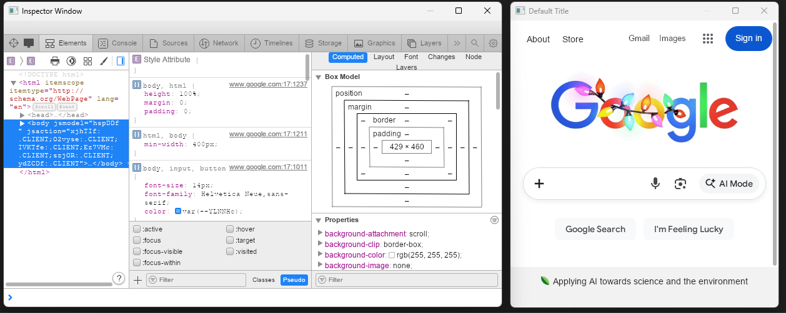
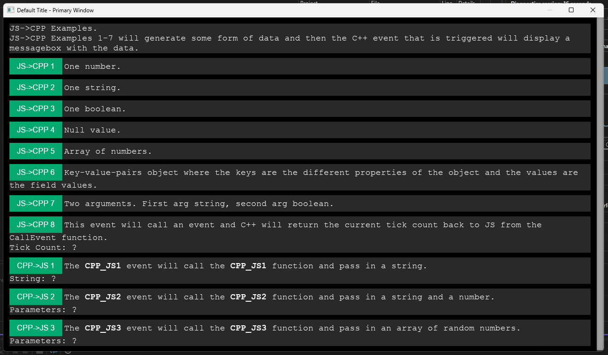
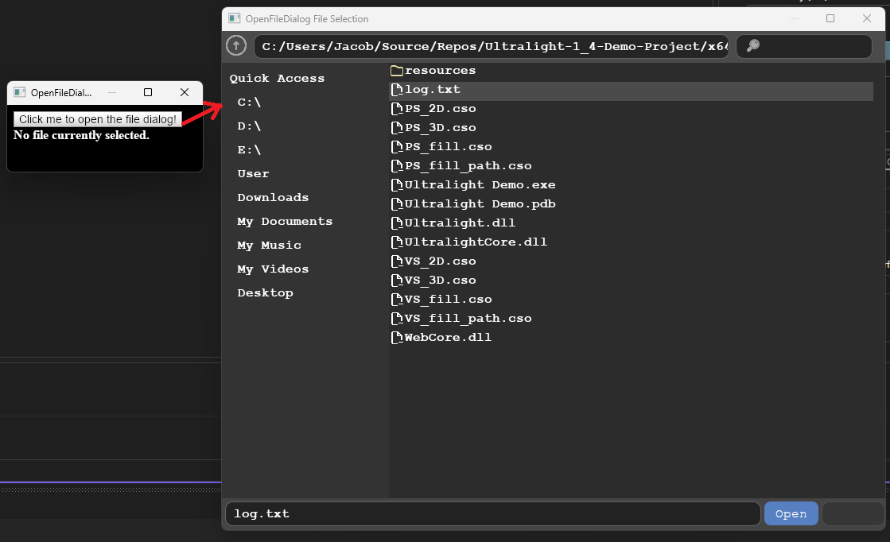
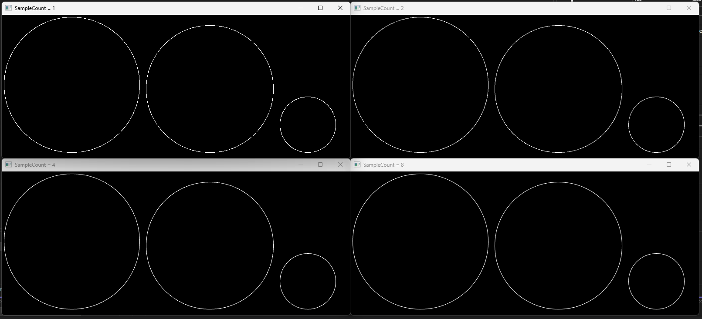
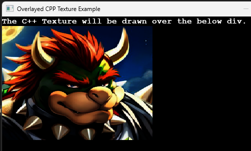
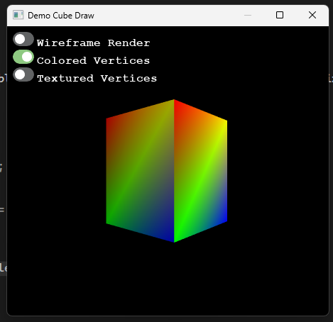
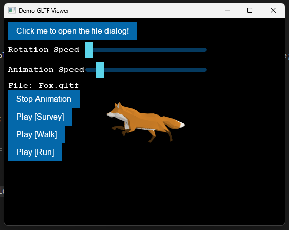
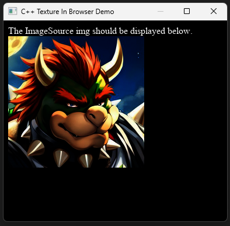
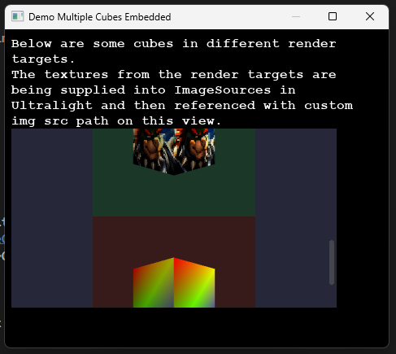

# Examples Documentation

This document provides an overview of the various demos included in this project. Each demo demonstrates different features of the application.

---

## Demos Overview

There are multiple demos available in this project. To access a demo in the application, click the button with the corresponding demo name.

---

## Demo #1: DemoBasic

This demo opens **two windows** that load `google.com`.  

- **GPU Renderer**: One window uses GPU rendering.  
- **CPU Renderer**: The other window uses CPU rendering.

---

## Demo #2: DemoBorderlessResizable

This demo creates a **borderless, resizable window** with a **custom title bar**.  

- Double-clicking the title bar maximizes/restores the window.  
- The title bar is rendered using an HTML view.

---

## Demo #3: DemoBorderlessResizableMovable

This demo extends **DemoBorderlessResizable** with **window dragging functionality**.  

- Click and drag the title bar to move the window around the screen.

---

## Demo #4: DemoInspector

This demo demonstrates using **multiple windows**:

- One window loads `google.com`.  
- Another window opens an **inspector view** for debugging or inspecting UI elements.

---

## Demo #5: DemoJSCPPCommunication

This demo shows **JS ↔ C++ communication** using an **Ultralight view**:  

- Multiple examples of passing data between JavaScript and C++ are included.  

---

## Demo #6: DemoOpenFileDialog

This demo creates a window with a button that spawns a **new window containing an OpenFileDialog**.  
The UI is built in HTML, and data is passed between the windows using **JavaScript ↔ C++ communication**.

---

## Demo #7: DemoTransparent

This demo demonstrates creating a **fully transparent window** with an image rendered inside.

---

## Demo #8: DemoAntiAliasTest

This demo opens up to **four windows** to demonstrate **MSAA (Multi-Sample Anti-Aliasing) levels** using the GPU renderer.  
- MSAA levels 1, 2, 4, and 8 are displayed if supported by the active GPU.

---

## Demo #9: DemoOverlayedCPPTexture

This demo retrieves the bounds of a `
` and draws a **C++ texture** over the approximate area.  
> Note: This method is **not recommended**; it was used prior to the introduction of the ImageSource API.

---

## Demo #10: DemoCubeDraw

This demo features an **HTML view with interactive buttons** to modify how a cube is rendered directly to the window's render target using **DirectX 11**.

---

## Demo #11: DemoGLTFViewer

This demo allows users to **load ASCII-format GLTF files** and view them in 3D, including all available **animations**.

---

## Demo #12: DemoCPPTextureInBrowser

This demo demonstrates using the **ImageSource API** to draw a **C++ DirectX 11 texture directly into an ``** element inside an Ultralight web view. This is the recommended method of embedding a DirectX11 texture in an ultralight view.

---

## Demo #13: DemoMultipleCubesEmbedded

This demo extends the **ImageSource API usage** by drawing textures associated with render targets into multiple `` elements in an Ultralight web view, showcasing **multiple cubes rendered simultaneously**.

